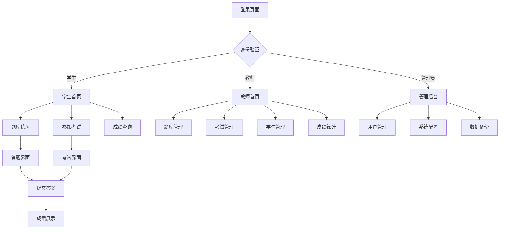

## 1. 产品概述

这是一个现代化的在线题库管理系统，旨在为教育机构、企业和个人提供高效的题目管理、练习和考试解决方案。

- **主要目标**：解决传统纸质题库管理效率低下、题目分类困难、练习统计不便等问题
- **目标用户**：教师、学生、培训机构、企业HR
- **核心价值**：提供智能化的题库管理、个性化练习推荐、详细的统计分析，提升教学和培训效率

## 2. 核心功能

### 2.1 用户角色

| 角色 | 注册方式 | 核心权限 |
|------|----------|----------|
| 学生用户 | 邮箱/手机号注册 | 浏览题目、参与练习、查看成绩、错题回顾 |
| 教师用户 | 邮箱/手机号注册 + 身份验证 | 题目管理、组卷考试、学生管理、成绩统计 |
| 管理员 | 后台创建 | 系统管理、用户管理、数据统计、系统配置 |

### 2.2 功能模块

题库管理系统包含以下核心页面：

1. **首页**：系统概览、快速入口、使用统计
2. **题库管理页**：题目列表、分类管理、题目编辑
3. **练习页面**：题目展示、答题界面、计时功能
4. **考试页面**：正式考试、防作弊、自动评分
5. **成绩统计页**：个人成绩、班级统计、详细分析
6. **用户管理页**：用户信息、权限管理、学习进度
7. **系统设置页**：个人设置、系统配置、数据备份

### 2.3 页面详情

| 页面名称 | 模块名称 | 功能描述 |
|----------|----------|----------|
| 首页 | 系统概览 | 显示系统使用统计、最新通知、快捷功能入口 |
| 首页 | 导航菜单 | 主导航栏，包含各功能模块入口 |
| 题库管理页 | 题目列表 | 展示所有题目，支持搜索、筛选、分页 |
| 题库管理页 | 题目编辑 | 创建/编辑题目，支持多种题型、富文本编辑 |
| 题库管理页 | 分类管理 | 题目分类创建、修改、删除 |
| 练习页面 | 题目展示 | 展示当前题目，支持上一题/下一题切换 |
| 练习页面 | 答题区域 | 答案输入、选项选择、提交答案 |
| 练习页面 | 计时功能 | 练习计时、剩余时间显示 |
| 考试页面 | 考试界面 | 正式考试环境，题目导航、时间控制 |
| 考试页面 | 防作弊 | 禁止复制粘贴、全屏模式、异常检测 |
| 考试页面 | 自动评分 | 客观题自动评分、主观题人工评分 |
| 成绩统计页 | 个人成绩 | 个人历史成绩、错题分析、知识点掌握情况 |
| 成绩统计页 | 班级统计 | 班级整体成绩、排名对比、进步趋势 |
| 用户管理页 | 用户信息 | 用户基本信息、学习记录、权限设置 |
| 用户管理页 | 批量操作 | 批量导入/导出用户、批量权限分配 |
| 系统设置页 | 个人设置 | 个人信息修改、密码重置、偏好设置 |
| 系统设置页 | 系统配置 | 系统参数配置、备份恢复、日志管理 |

## 3. 核心流程

### 学生用户流程
学生登录系统后，可以选择进行练习或参加考试。练习模式下可以自由选择题库和题目数量，系统会记录答题情况并给出即时反馈。考试模式下需要进入正式的考试环境，系统会严格控制考试时间并防止作弊行为。

### 教师用户流程
教师可以管理题库，包括创建、编辑、删除题目，设置题目分类和难度。可以组织考试，设置考试参数，管理学生信息，查看和分析学生成绩数据。

### 管理员流程
管理员负责整个系统的运行维护，包括用户管理、系统配置、数据备份、系统监控等。

## 4. 用户界面设计

### 4.1 设计风格

- **主色调**：蓝色系（#1890ff）为主，体现专业和可信赖
- **辅助色**：绿色（#52c41a）表示成功，红色（#ff4d4f）表示错误
- **按钮风格**：圆角矩形，主要按钮使用主色调
- **字体**：系统默认字体，标题16-18px，正文14px
- **布局风格**：卡片式布局，左侧导航+右侧内容区域
- **图标风格**：使用Ant Design图标库，线条简洁风格

### 4.2 页面设计概览

| 页面名称 | 模块名称 | UI元素 |
|----------|----------|--------|
| 首页 | 统计卡片 | 圆角卡片设计，渐变背景，数据动画效果 |
| 题库管理页 | 数据表格 | 斑马纹表格，悬停高亮，操作按钮组 |
| 练习页面 | 题目卡片 | 白色背景，阴影效果，题目序号导航 |
| 考试页面 | 考试面板 | 全屏模式，简洁设计，时间倒计时显示 |
| 成绩统计页 | 图表展示 | 柱状图、饼图、折线图组合展示 |

### 4.3 响应式设计

- **桌面优先**：主要面向桌面端用户设计
- **移动端适配**：支持平板和手机访问，采用响应式布局
- **触摸优化**：按钮大小适配触摸操作，支持手势滑动

## 5. 非功能性需求

### 5.1 性能要求
- 页面加载时间不超过3秒
- 支持1000+用户同时在线
- 数据库查询响应时间不超过500ms

### 5.2 安全性要求
- 用户密码加密存储
- 防止SQL注入和XSS攻击
- 实现HTTPS加密传输
- 用户权限严格控制

### 5.3 可靠性要求
- 系统可用性达到99.9%
- 数据备份每日执行
- 支持故障恢复和数据恢复