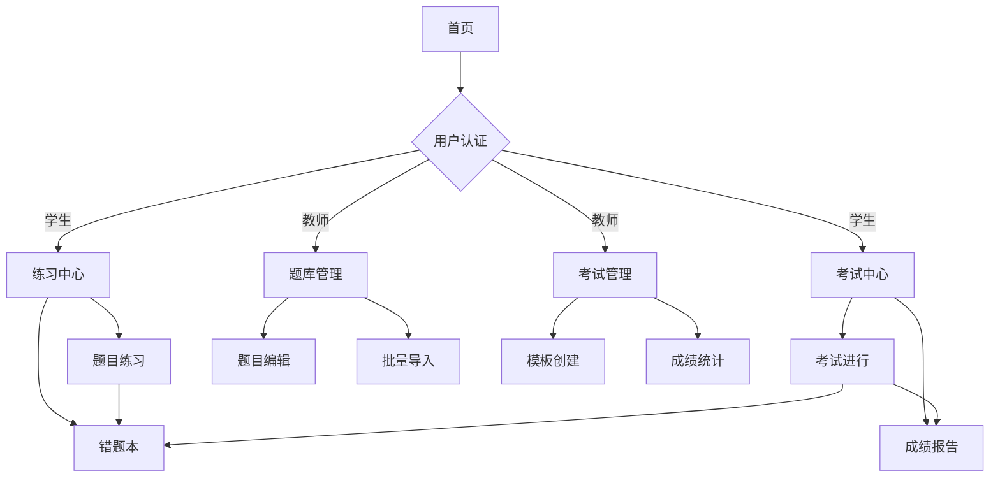

## 1. Product Overview
智能题库管理系统，支持多题型练习、考试测评、错题管理等功能。面向学生提供个性化学习体验，面向教师提供题库管理和考试组织工具。

## 2. Core Features

### 2.1 User Roles
| Role | Registration Method | Core Permissions |
|------|---------------------|------------------|
| Student | Email registration | 练习答题、参加考试、查看错题、学习记录 |
| Teacher | Admin invitation | 题库管理、考试创建、学生成绩查看 |
| Admin | System initialization | 用户管理、系统配置、数据审计 |

### 2.2 Feature Module
系统包含以下核心页面：
1. **首页**: 系统介绍、用户登录入口、功能导航
2. **登录注册页**: 用户认证、密码管理、JWT令牌处理
3. **练习中心**: 专题选择、题目练习、实时评分、答题记录
4. **考试中心**: 考试列表、考试进行、交卷评分、成绩报告
5. **错题本**: 错题展示、掌握状态管理、错题重做
6. **学习记录**: 答题历史、正确率统计、学习进度
7. **题库管理**: 题目CRUD、批量导入、编辑器、版本控制
8. **考试管理**: 模板创建、规则配置、成绩统计

### 2.3 Page Details
| Page Name | Module Name | Feature description |
|-----------|-------------|---------------------|
| 首页 | Hero section | 展示系统特色功能，提供快速入口导航 |
| 首页 | Navigation | 响应式导航栏，支持角色权限控制 |
| 登录注册页 | 用户登录 | 支持用户名/邮箱登录，JWT认证，自动续期 |
| 登录注册页 | 用户注册 | 用户名唯一性校验，密码强度验证，bcrypt加密 |
| 练习中心 | 专题选择 | 树形结构展示题库分类，支持多选组合 |
| 练习中心 | 题目练习 | 按难度权重随机抽题，支持Markdown+LaTeX渲染 |
| 练习中心 | 实时评分 | 客观题即时判分，主观题记录作答 |
| 练习中心 | 答题记录 | 存储完整答题历史，计算专题正确率 |
| 考试中心 | 考试列表 | 展示可用考试，显示时间限制和规则说明 |
| 考试中心 | 考试进行 | 倒计时功能，题目导航，答案暂存 |
| 考试中心 | 交卷评分 | 自动生成成绩报告，错题归集到错题本 |
| 错题本 | 错题展示 | 智能筛选高频错题，支持分类查看 |
| 错题本 | 掌握机制 | 连续正确3次自动移出，支持手动标记 |
| 学习记录 | 答题历史 | 时间轴展示学习轨迹，支持筛选查询 |
| 学习记录 | 统计分析 | 正确率趋势图，知识点掌握度评估 |
| 题库管理 | 题目编辑器 | 分屏实时预览，LaTeX公式快捷输入 |
| 题库管理 | 批量导入 | JSON Schema验证，事务处理，去重机制 |
| 考试管理 | 模板配置 | 可视化规则编辑器，支持题型组合配置 |
| 考试管理 | 成绩统计 | 多维度成绩分析，支持导出报表 |

## 3. Core Process
### 学生用户流程
学生从首页进入系统，完成注册登录后可选择练习模式或考试模式。练习模式下选择专题后开始答题，系统自动评分并记录答题历史，错题自动进入错题本。考试模式下选择考试模板，系统按规则生成试卷，考试结束后自动生成成绩报告。

### 教师用户流程
教师登录后可进入管理后台，使用题库管理功能创建和编辑题目，支持Markdown和LaTeX格式。可创建考试模板，配置题型规则和分值分布。查看学生考试成绩和答题情况，进行教学分析。

## 4. User Interface Design
### 4.1 Design Style
- **主色调**: 蓝色系 (#1890ff) 体现教育专业性
- **辅助色**: 绿色 (#52c41a) 表示正确，红色 (#ff4d4f) 表示错误
- **按钮样式**: 圆角矩形，主要操作使用主色调
- **字体**: 优先使用系统字体，标题16-18px，正文14px
- **布局风格**: 卡片式布局，响应式网格系统
- **图标风格**: 使用Ant Design图标库，保持一致性

### 4.2 Page Design Overview
| Page Name | Module Name | UI Elements |
|-----------|-------------|-------------|
| 首页 | Hero section | 全屏背景图，标题文字动画，功能卡片网格布局 |
| 练习中心 | 专题选择 | 左侧树形菜单，右侧题目列表，支持拖拽排序 |
| 题目练习 | 答题界面 | 左侧题目内容区，右侧答题区，顶部进度条 |
| 考试中心 | 考试列表 | 表格展示，包含状态标签，操作按钮组 |
| 错题本 | 错题展示 | 卡片式布局，显示错误次数和最近错误时间 |
| 题库管理 | 编辑器 | 分屏设计，左侧Markdown输入，右侧实时预览 |

### 4.3 Responsiveness
采用桌面端优先设计，适配1200px以上大屏幕。移动端自适应，触摸交互优化，支持手势操作。考试界面在移动设备上采用全屏模式，隐藏干扰元素。