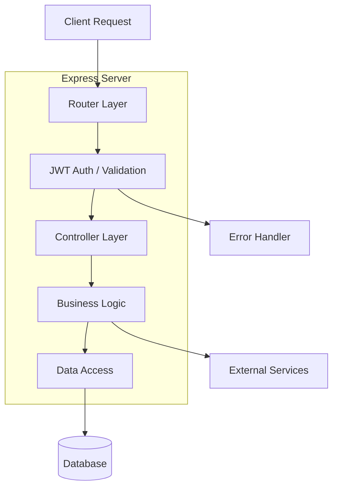
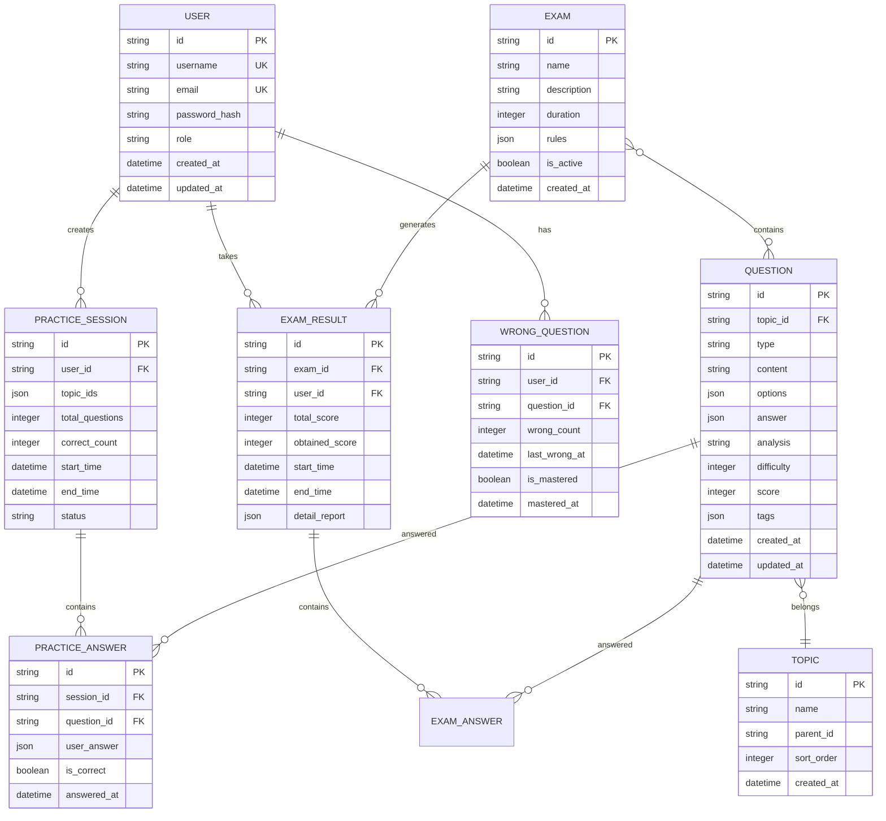

## 1. Architecture design

```mermaid
graph TD
  A[User Browser] --> B[React Frontend Application]
  B --> C[Express Backend API]
  C --> D[SQLite Dev / PostgreSQL Prod]
  C --> E[JWT Authentication]
  C --> F[Question Import Service]
  
  subgraph "Frontend Layer"
    B[B[React 18 + TypeScript + Vite]]
  end
  
  subgraph "Backend Layer"
    C[C[Express 5 + TypeScript]]
    E
    F
  end
  
  subgraph "Data Layer"
    D
  end
```

## 2. Technology Description

* **Frontend**: React\@18 + TypeScript\@5 + Vite\@4 + Tailwind CSS\@3 + Zustand\@4

* **Backend**: Express\@5 + TypeScript + Prisma\@4 + JWT\@9

* **Database**: SQLite\@3 (开发) / PostgreSQL\@15 (生产)

* **公式渲染**: KaTeX\@0.16 + MathJax\@3

* **Markdown解析**: react-markdown\@8

* **HTTP客户端**: Axios\@1.2

* **测试框架**: Jest + React Testing Library + Cypress\@12

## 3. Route definitions

| Route           | Purpose          |
| --------------- | ---------------- |
| /               | 首页，系统介绍和功能导航     |
| /login          | 登录页面，用户认证入口      |
| /register       | 注册页面，新用户注册       |
| /practice       | 练习中心，专题选择和题目练习   |
| /exam           | 考试中心，考试列表和进行考试   |
| /wrongbook      | 错题本，错题管理和重做      |
| /record         | 学习记录，答题历史和统计分析   |
| /admin/question | 题库管理，题目CRUD和批量导入 |
| /admin/exam     | 考试管理，模板创建和成绩统计   |
| /profile        | 用户资料，个人信息和设置     |

## 4. API definitions

### 4.1 Authentication API

**用户注册**

```
POST /api/auth/register
```

Request:

| Param Name | Param Type | isRequired | Description         |
| ---------- | ---------- | ---------- | ------------------- |
| username   | string     | true       | 用户名，3-20字符，支持中英文+数字 |
| email      | string     | true       | 邮箱地址，用于登录           |
| password   | string     | true       | 密码，8-32位            |
| role       | string     | false      | 角色，默认为'student'     |

Response:

| Param Name | Param Type | Description |
| ---------- | ---------- | ----------- |
| success    | boolean    | 注册成功状态      |
| user       | object     | 用户基础信息      |
| token      | string     | JWT令牌       |

**用户登录**

```
POST /api/auth/login
```

Request:

| Param Name | Param Type | isRequired | Description |
| ---------- | ---------- | ---------- | ----------- |
| username   | string     | true       | 用户名或邮箱      |
| password   | string     | true       | 密码          |

Response:

| Param Name | Param Type | Description   |
| ---------- | ---------- | ------------- |
| success    | boolean    | 登录成功状态        |
| token      | string     | JWT令牌，有效期24小时 |
| user       | object     | 用户完整信息        |

### 4.2 Question API

**获取题目列表**

```
GET /api/questions
```

Query Parameters:

| Param Name | Param Type | Description |
| ---------- | ---------- | ----------- |
| topicId    | string     | 专题ID        |
| type       | string     | 题目类型        |
| difficulty | number     | 难度等级        |
| page       | number     | 页码          |
| limit      | number     | 每页数量        |

**创建题目**

```
POST /api/questions
```

Request Body:

```typescript
{
  topicId: string;
  type: 'single' | 'multiple' | 'fill' | 'subjective';
  content: string; // Markdown+LaTeX
  options?: { id: string; content: string }[];
  answer: string | string[];
  analysis: string;
  difficulty: 1-5;
  score: number;
  tags: string[];
}
```

**批量导入题目**

```
POST /api/questions/bulk
```

Request Body:

```typescript
{
  questions: Question[];
  validateSchema: boolean;
}
```

### 4.3 Practice API

**开始练习**

```
POST /api/practice/start
```

Request Body:

| Param Name      | Param Type | Description |
| --------------- | ---------- | ----------- |
| topicIds        | string\[]  | 专题ID数组      |
| questionCount   | number     | 题目数量        |
| difficultyRange | number\[]  | 难度范围        |

**提交答案**

```
POST /api/practice/submit
```

Request Body:

| Param Name | Param Type | Description |
| ---------- | ---------- | ----------- |
| practiceId | string     | 练习会话ID      |
| answers    | object\[]  | 答案数组        |
| completed  | boolean    | 是否完成        |

### 4.4 Exam API

**创建考试**

```
POST /api/exams
```

Request Body:

```typescript
{
  name: string;
  description: string;
  duration: number;
  rules: {
    topicId: string;
    questionTypes: {
      type: QuestionType;
      count: number;
      score: number;
      difficulty?: number[];
    }[];
  }[];
}
```

**开始考试**

```
POST /api/exams/:id/start
```

**提交考试**

```
POST /api/exams/:id/submit
```

## 5. Server architecture diagram



## 6. Data model

### 6.1 Data model definition



### 6.2 Data Definition Language

**用户表**

```sql
CREATE TABLE users (
  id UUID PRIMARY KEY DEFAULT gen_random_uuid(),
  username VARCHAR(50) UNIQUE NOT NULL,
  email VARCHAR(255) UNIQUE NOT NULL,
  password_hash VARCHAR(255) NOT NULL,
  role VARCHAR(20) DEFAULT 'student' CHECK (role IN ('student', 'teacher', 'admin')),
  created_at TIMESTAMP DEFAULT CURRENT_TIMESTAMP,
  updated_at TIMESTAMP DEFAULT CURRENT_TIMESTAMP
);

CREATE INDEX idx_users_username ON users(username);
CREATE INDEX idx_users_email ON users(email);
CREATE INDEX idx_users_role ON users(role);
```

**题目表**

```sql
CREATE TABLE questions (
  id UUID PRIMARY KEY DEFAULT gen_random_uuid(),
  topic_id UUID NOT NULL,
  type VARCHAR(20) CHECK (type IN ('single', 'multiple', 'fill', 'subjective')),
  content TEXT NOT NULL,
  options JSON,
  answer JSON NOT NULL,
  analysis TEXT,
  difficulty INTEGER CHECK (difficulty BETWEEN 1 AND 5),
  score INTEGER DEFAULT 1,
  tags JSON,
  created_at TIMESTAMP DEFAULT CURRENT_TIMESTAMP,
  updated_at TIMESTAMP DEFAULT CURRENT_TIMESTAMP,
  FOREIGN KEY (topic_id) REFERENCES topics(id)
);

CREATE INDEX idx_questions_topic ON questions(topic_id);
CREATE INDEX idx_questions_type ON questions(type);
CREATE INDEX idx_questions_difficulty ON questions(difficulty);
```

**专题表**

```sql
CREATE TABLE topics (
  id UUID PRIMARY KEY DEFAULT gen_random_uuid(),
  name VARCHAR(100) NOT NULL,
  parent_id UUID,
  sort_order INTEGER DEFAULT 0,
  created_at TIMESTAMP DEFAULT CURRENT_TIMESTAMP,
  FOREIGN KEY (parent_id) REFERENCES topics(id)
);

CREATE INDEX idx_topics_parent ON topics(parent_id);
CREATE INDEX idx_topics_sort ON topics(sort_order);
```

**练习会话表**

```sql
CREATE TABLE practice_sessions (
  id UUID PRIMARY KEY DEFAULT gen_random_uuid(),
  user_id UUID NOT NULL,
  topic_ids JSON NOT NULL,
  total_questions INTEGER NOT NULL,
  correct_count INTEGER DEFAULT 0,
  start_time TIMESTAMP DEFAULT CURRENT_TIMESTAMP,
  end_time TIMESTAMP,
  status VARCHAR(20) DEFAULT 'in_progress',
  FOREIGN KEY (user_id) REFERENCES users(id)
);

CREATE INDEX idx_practice_user ON practice_sessions(user_id);
CREATE INDEX idx_practice_status ON practice_sessions(status);
CREATE INDEX idx_practice_time ON practice_sessions(start_time);
```

**错题表**

```sql
CREATE TABLE wrong_questions (
  id UUID PRIMARY KEY DEFAULT gen_random_uuid(),
  user_id UUID NOT NULL,
  question_id UUID NOT NULL,
  wrong_count INTEGER DEFAULT 1,
  last_wrong_at TIMESTAMP DEFAULT CURRENT_TIMESTAMP,
  is_mastered BOOLEAN DEFAULT FALSE,
  mastered_at TIMESTAMP,
  FOREIGN KEY (user_id) REFERENCES users(id),
  FOREIGN KEY (question_id) REFERENCES questions(id),
  UNIQUE(user_id, question_id)
);

CREATE INDEX idx_wrong_user ON wrong_questions(user_id);
CREATE INDEX idx_wrong_question ON wrong_questions(question_id);
CREATE INDEX idx_wrong_mastered ON wrong_questions(is_mastered);
```

