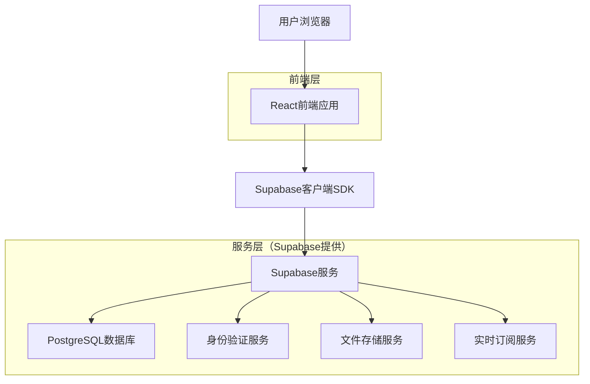
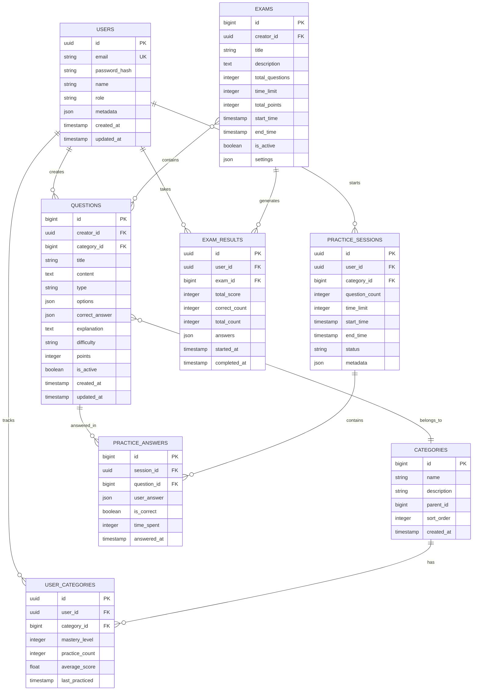

## 1. 架构设计



## 2. 技术栈描述

- **前端**：React@18 + TypeScript + Tailwind CSS + Vite
- **后端**：Supabase（BaaS平台，提供完整后端服务）
- **数据库**：PostgreSQL（由Supabase托管）
- **状态管理**：React Context + Zustand
- **UI组件库**：Ant Design + 自定义组件
- **图表库**：Chart.js + ECharts
- **构建工具**：Vite

## 3. 路由定义

| 路由 | 用途 |
|------|------|
| / | 首页，系统概览和快速入口 |
| /login | 登录页面，用户身份验证 |
| /register | 注册页面，新用户注册 |
| /dashboard | 仪表板，个人数据概览 |
| /questions | 题库管理页面，题目列表和管理 |
| /questions/create | 创建题目页面，新建题目 |
| /questions/edit/:id | 编辑题目页面，修改题目 |
| /practice | 练习页面，选择题库开始练习 |
| /practice/session | 练习会话页面，实际答题界面 |
| /exam | 考试列表页面，查看可参加的考试 |
| /exam/:id | 考试页面，参加具体考试 |
| /results | 成绩查询页面，查看历史成绩 |
| /statistics | 统计分析页面，详细数据分析 |
| /users | 用户管理页面（教师/管理员） |
| /settings | 系统设置页面，个人和系统配置 |
| /profile | 个人资料页面，用户信息管理 |

## 4. API定义

### 4.1 认证相关API

```typescript
// 用户登录
POST /auth/v1/token?grant_type=password

Request:
{
  "email": string,
  "password": string
}

Response:
{
  "access_token": string,
  "refresh_token": string,
  "user": User
}

// 用户注册
POST /auth/v1/signup

Request:
{
  "email": string,
  "password": string,
  "data": {
    "name": string,
    "role": 'student' | 'teacher' | 'admin'
  }
}
```

### 4.2 题目管理API

```typescript
// 获取题目列表
GET /rest/v1/questions

Query Parameters:
- category_id?: number
- difficulty?: 'easy' | 'medium' | 'hard'
- type?: 'single' | 'multiple' | 'true_false' | 'fill_blank'
- search?: string
- page?: number
- limit?: number

Response:
{
  "data": Question[],
  "count": number
}

// 创建题目
POST /rest/v1/questions

Request:
{
  "title": string,
  "content": string,
  "type": string,
  "options": string[],
  "correct_answer": string | string[],
  "explanation": string,
  "category_id": number,
  "difficulty": string,
  "points": number
}

// 更新题目
PATCH /rest/v1/questions?id=eq.{id}

// 删除题目
DELETE /rest/v1/questions?id=eq.{id}
```

### 4.3 练习和考试API

```typescript
// 开始练习会话
POST /rest/v1/practice_sessions

Request:
{
  "user_id": string,
  "category_id": number,
  "question_count": number,
  "time_limit": number
}

// 提交答案
POST /rest/v1/practice_answers

Request:
{
  "session_id": string,
  "question_id": number,
  "user_answer": string | string[],
  "is_correct": boolean,
  "time_spent": number
}

// 获取考试成绩
GET /rest/v1/exam_results?user_id=eq.{user_id}

Response:
{
  "data": ExamResult[],
  "details": {
    "total_score": number,
    "correct_count": number,
    "total_count": number,
    "accuracy_rate": number
  }
}
```

### 4.4 统计分析API

```typescript
// 获取用户统计数据
GET /rest/v1/user_statistics?user_id=eq.{user_id}

Response:
{
  "data": {
    "total_practices": number,
    "total_exams": number,
    "average_score": number,
    "strongest_category": string,
    "weakest_category": string,
    "improvement_trend": number[]
  }
}

// 获取班级统计数据（教师）
GET /rest/v1/class_statistics?class_id=eq.{class_id}

Response:
{
  "data": {
    "student_count": number,
    "average_score": number,
    "score_distribution": number[],
    "top_performers": User[],
    "needs_improvement": User[]
  }
}
```

## 5. 数据模型

### 5.1 数据库实体关系图



### 5.2 数据定义语言

```sql
-- 用户表
CREATE TABLE users (
    id UUID PRIMARY KEY DEFAULT gen_random_uuid(),
    email VARCHAR(255) UNIQUE NOT NULL,
    password_hash VARCHAR(255) NOT NULL,
    name VARCHAR(100) NOT NULL,
    role VARCHAR(20) DEFAULT 'student' CHECK (role IN ('student', 'teacher', 'admin')),
    metadata JSONB DEFAULT '{}',
    created_at TIMESTAMP WITH TIME ZONE DEFAULT NOW(),
    updated_at TIMESTAMP WITH TIME ZONE DEFAULT NOW()
);

-- 分类表
CREATE TABLE categories (
    id BIGSERIAL PRIMARY KEY,
    name VARCHAR(100) NOT NULL,
    description TEXT,
    parent_id BIGINT REFERENCES categories(id),
    sort_order INTEGER DEFAULT 0,
    created_at TIMESTAMP WITH TIME ZONE DEFAULT NOW()
);

-- 题目表
CREATE TABLE questions (
    id BIGSERIAL PRIMARY KEY,
    creator_id UUID REFERENCES users(id) ON DELETE CASCADE,
    category_id BIGINT REFERENCES categories(id) ON DELETE SET NULL,
    title VARCHAR(255) NOT NULL,
    content TEXT NOT NULL,
    type VARCHAR(20) CHECK (type IN ('single', 'multiple', 'true_false', 'fill_blank')),
    options JSONB DEFAULT '[]',
    correct_answer JSONB NOT NULL,
    explanation TEXT,
    difficulty VARCHAR(10) CHECK (difficulty IN ('easy', 'medium', 'hard')),
    points INTEGER DEFAULT 1,
    is_active BOOLEAN DEFAULT true,
    created_at TIMESTAMP WITH TIME ZONE DEFAULT NOW(),
    updated_at TIMESTAMP WITH TIME ZONE DEFAULT NOW()
);

-- 练习会话表
CREATE TABLE practice_sessions (
    id UUID PRIMARY KEY DEFAULT gen_random_uuid(),
    user_id UUID REFERENCES users(id) ON DELETE CASCADE,
    category_id BIGINT REFERENCES categories(id) ON DELETE SET NULL,
    question_count INTEGER NOT NULL,
    time_limit INTEGER,
    start_time TIMESTAMP WITH TIME ZONE DEFAULT NOW(),
    end_time TIMESTAMP WITH TIME ZONE,
    status VARCHAR(20) DEFAULT 'active' CHECK (status IN ('active', 'completed', 'abandoned')),
    metadata JSONB DEFAULT '{}'
);

-- 练习答案表
CREATE TABLE practice_answers (
    id BIGSERIAL PRIMARY KEY,
    session_id UUID REFERENCES practice_sessions(id) ON DELETE CASCADE,
    question_id BIGINT REFERENCES questions(id) ON DELETE CASCADE,
    user_answer JSONB,
    is_correct BOOLEAN,
    time_spent INTEGER DEFAULT 0,
    answered_at TIMESTAMP WITH TIME ZONE DEFAULT NOW()
);

-- 考试表
CREATE TABLE exams (
    id BIGSERIAL PRIMARY KEY,
    creator_id UUID REFERENCES users(id) ON DELETE CASCADE,
    title VARCHAR(255) NOT NULL,
    description TEXT,
    total_questions INTEGER NOT NULL,
    time_limit INTEGER NOT NULL,
    total_points INTEGER NOT NULL,
    start_time TIMESTAMP WITH TIME ZONE,
    end_time TIMESTAMP WITH TIME ZONE,
    is_active BOOLEAN DEFAULT true,
    settings JSONB DEFAULT '{}',
    created_at TIMESTAMP WITH TIME ZONE DEFAULT NOW()
);

-- 考试题目关联表
CREATE TABLE exam_questions (
    id BIGSERIAL PRIMARY KEY,
    exam_id BIGINT REFERENCES exams(id) ON DELETE CASCADE,
    question_id BIGINT REFERENCES questions(id) ON DELETE CASCADE,
    question_order INTEGER,
    points INTEGER DEFAULT 1,
    UNIQUE(exam_id, question_id)
);

-- 考试结果表
CREATE TABLE exam_results (
    id UUID PRIMARY KEY DEFAULT gen_random_uuid(),
    user_id UUID REFERENCES users(id) ON DELETE CASCADE,
    exam_id BIGINT REFERENCES exams(id) ON DELETE CASCADE,
    total_score INTEGER,
    correct_count INTEGER,
    total_count INTEGER,
    answers JSONB DEFAULT '{}',
    started_at TIMESTAMP WITH TIME ZONE DEFAULT NOW(),
    completed_at TIMESTAMP WITH TIME ZONE,
    UNIQUE(user_id, exam_id)
);

-- 用户分类掌握度表
CREATE TABLE user_categories (
    id BIGSERIAL PRIMARY KEY,
    user_id UUID REFERENCES users(id) ON DELETE CASCADE,
    category_id BIGINT REFERENCES categories(id) ON DELETE CASCADE,
    mastery_level INTEGER DEFAULT 0 CHECK (mastery_level >= 0 AND mastery_level <= 100),
    practice_count INTEGER DEFAULT 0,
    average_score FLOAT DEFAULT 0,
    last_practiced TIMESTAMP WITH TIME ZONE,
    UNIQUE(user_id, category_id)
);

-- 创建索引
CREATE INDEX idx_users_email ON users(email);
CREATE INDEX idx_questions_category ON questions(category_id);
CREATE INDEX idx_questions_creator ON questions(creator_id);
CREATE INDEX idx_practice_sessions_user ON practice_sessions(user_id);
CREATE INDEX idx_practice_answers_session ON practice_answers(session_id);
CREATE INDEX idx_practice_answers_question ON practice_answers(question_id);
CREATE INDEX idx_exam_results_user ON exam_results(user_id);
CREATE INDEX idx_exam_results_exam ON exam_results(exam_id);
CREATE INDEX idx_user_categories_user ON user_categories(user_id);
CREATE INDEX idx_user_categories_category ON user_categories(category_id);

-- 权限设置
GRANT SELECT ON ALL TABLES TO anon;
GRANT ALL PRIVILEGES ON ALL TABLES TO authenticated;
GRANT USAGE ON ALL SEQUENCES TO authenticated;

-- 初始数据
INSERT INTO categories (name, description, sort_order) VALUES
('数学', '数学相关题目', 1),
('语文', '语文相关题目', 2),
('英语', '英语相关题目', 3),
('物理', '物理相关题目', 4),
('化学', '化学相关题目', 5);

INSERT INTO users (email, password_hash, name, role) VALUES
('admin@example.com', '$2a$10$rQZ9qW5tX6y9zN3k8m.nP.9P8m.N2qK8tL4vM6nO1pQ3rS5tU7vW9', '管理员', 'admin');
```

## 6. 安全性和性能考虑

### 6.1 安全措施

1. **身份验证**：使用Supabase内置的身份验证系统，支持JWT令牌
2. **权限控制**：基于角色的访问控制（RBAC），严格限制数据访问权限
3. **数据加密**：敏感数据加密存储，传输过程使用HTTPS
4. **SQL注入防护**：使用Supabase的查询构建器，避免直接SQL拼接
5. **XSS防护**：前端输入验证和输出编码
6. **CSRF防护**：使用同源策略和令牌验证

### 6.2 性能优化

1. **数据库优化**：
   - 合理的索引设计
   - 查询优化和分页
   - 连接池配置

2. **前端优化**：
   - 代码分割和懒加载
   - 图片压缩和CDN
   - 缓存策略
   - 虚拟滚动（大数据列表）

3. **API优化**：
   - 数据分页和过滤
   - 批量操作支持
   - 缓存机制

### 6.3 监控和日志

1. **应用监控**：集成错误监控工具（Sentry）
2. **性能监控**：前端性能指标收集
3. **访问日志**：记录用户关键操作
4. **审计日志**：重要数据变更记录